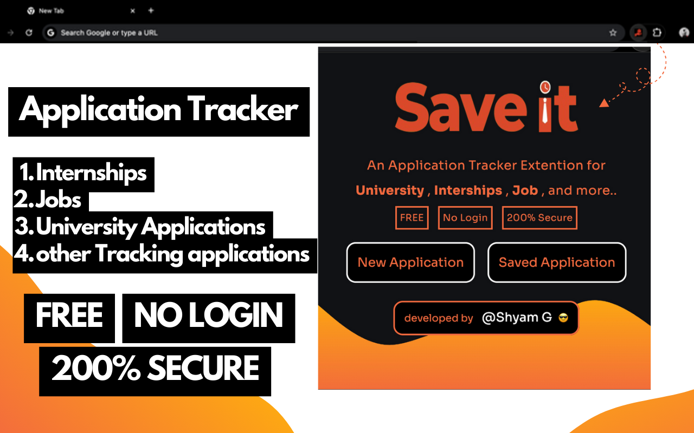
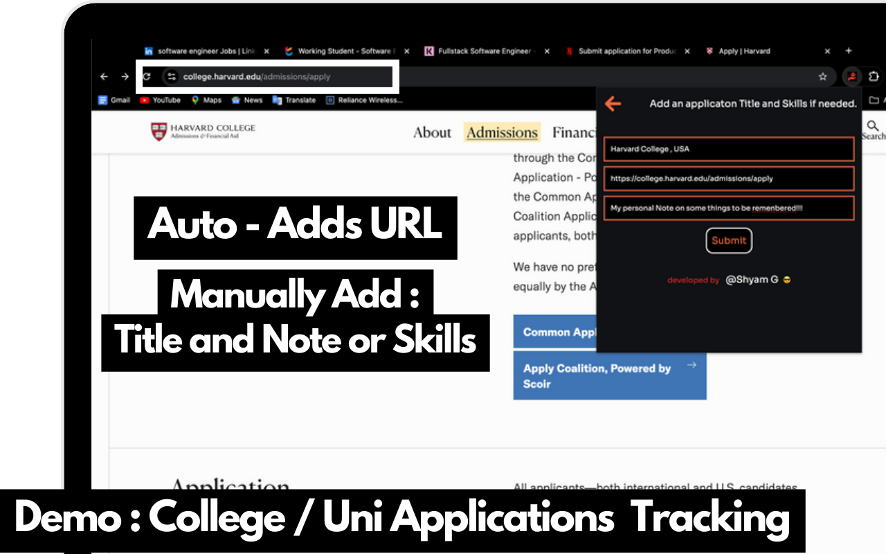
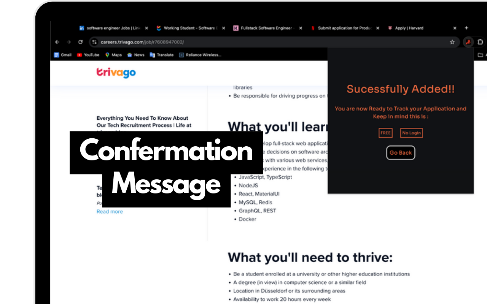
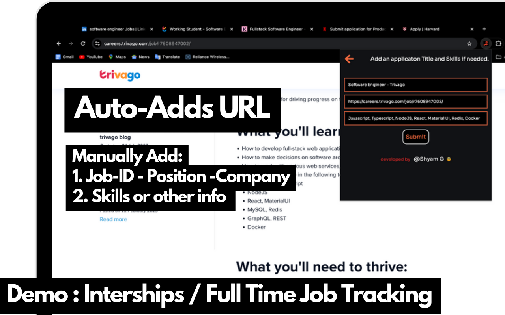
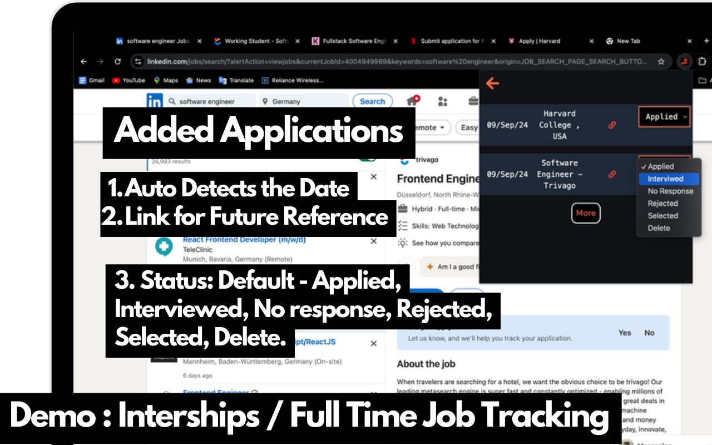

# SaveIT - Application Tracker

**SaveIT - Application Tracker** is a FREE, NO LOGIN Chrome extension designed to help you manage multiple applications effortlessly, whether for university, internships, jobs, or any other opportunities. Say goodbye to tedious spreadsheets and scattered notes—SaveIT keeps all your application details secure within your browser, with no external storage, no data leaks, and 200% data security. 

## Key Features
- ### **Effortless Tracking:** Manage all your applications, from university to job hunts, in one place without the hassle of external tools.
- ### **No External Storage:** All your data is stored securely within your browser—ensuring complete privacy and security.
- ### **Automatic URL Capture:** The extension automatically captures the application URL and fills in key information for a smooth experience.
- ### **Status Management:** Easily update the status of your applications with options like "Selected," "Rejected," "No Response," and "Interviewed."
- ### **Simple Interface:** Add, view, and manage your applications with an intuitive and user-friendly interface.
- ### **Completely Free:** SaveIT is entirely free to use, with no hidden costs or subscription fees.
- ### **No Login Required:** Start using the extension instantly, without the need to create an account.

## How It Works, Screenshots and Demo.
1. ### **Home Page:** On the first page, you can start a new application or view saved applications.

2. ### **New Application:** Click on "New Application," and you’ll be taken to the second page where the URL is automatically populated. You can then fill in other details like title, date, and status.

3. ### **Application Management:** After submitting, the extension checks if the application already exists and prompts you accordingly. You can view and manage all your applications with options to update statuses, such as "Selected," "Rejected," "No Response," and "Interviewed."

4. ### **View Applications:** Easily see all your saved applications with their respective submission dates and statuses.

## Disclaimer
Clearing your browser’s local storage or cache will delete all your saved applications. Please back up any important data to avoid losing it.

## Installation
1. Download the extension from the [Chrome Web Store](#).
2. Click “Add to Chrome” to install the extension.
3. Start tracking your applications instantly with no setup required!
<!-- 

### Watch the Demo
 -->

## Feedback and Support
If you have any questions or feedback, please [open an issue](https://github.com/shyamg090/SaveIt---Application-Tracker-Public-Version-.git) in the repository.

---

Let me know if you'd like any further adjustments.